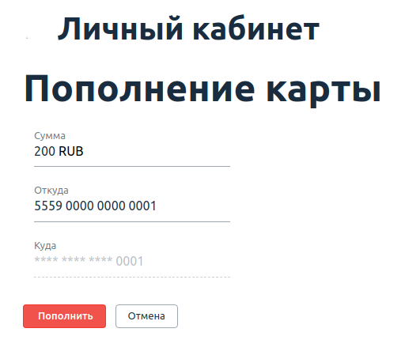

[](https://ci.appveyor.com/project/molottva/cardbalance)

# Домашнее задание к занятию «2.4. BDD»

## Задача №1 - Page Object's

Вам необходимо "добить" тестирование функции перевода с карты на карту. Разработчики пока реализовали возможность перевода только между своими картами, но уже хотят, чтобы вы всё протестировали.

Для этого они не поленились и захардкодили вам целого одного пользователя:
```
* login: 'vasya'
* password: 'qwerty123'
* verification code (hardcoded): '12345'
* cards:
    * first:
        * number: '5559 0000 0000 0001'
        * balance: 10 000 RUB
    * second:
        * number: '5559 0000 0000 0002'
        * balance: 10 000 RUB
```

После логина (который уже мы сделали на лекции), вы получите список карт:


Нажав на кнопку "Пополнить" вы перейдёте на страницу перевода средств:



При успешном переводе, вы вернётесь назад на страницу со списком карт.

Это ключевой кейс, который нужно протестировать.

Нужно, чтобы вы через Page Object'ы добавили доменные методы:
* Перевода с определённой карты на другую карту n'ой суммы
* Проверки баланса по карте (со страницы списка карт)

**Вы можете познакомиться с некоторыми подсказками [по реализации этой задачи](balance.md)**.

PS: чтобы вам было не скучно, мы там добавили порядком багов, поэтому как минимум одно Issue в GitHub у вас должно быть 😈.

<details>
    <summary>Подсказка</summary>

    Обратите внимание на то, что ваши тесты должны проходить целиком (т.е. весь набор тестов). Мы как всегда заложили там небольшую ловушку, чтобы вам не было скучно 😈.
    
    Не закладывайтесь на то, что на картах для каждого теста всегда одна и та же фиксированная сумма, подумайте, как работать с SUT так, чтобы не приходилось её (SUT) перезапускать для каждого теста.
</details>
